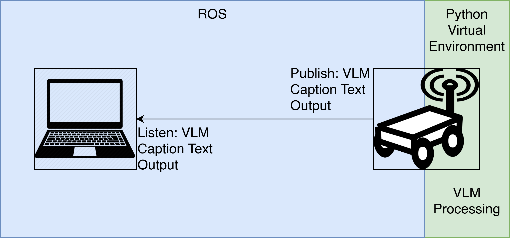
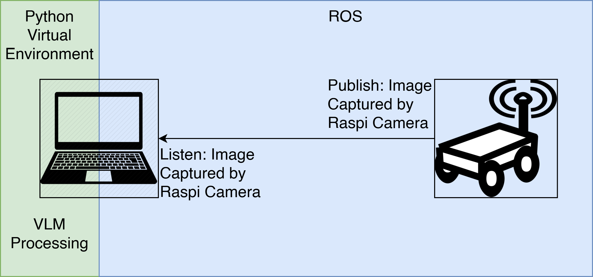

# Mobile-Robot-VLM
Mobile Robot with VLM code

## Overview
Implementing Vision-Language Model into Mobiel Robot

## Pre-requisite
Download VLM model from https://github.com/vikhyat/moondream and put inside the "models" folder

The "base_station" directory contains:
- "image_talker_listener" ros package for base station in laptop or PC
- "MR-TP-FIX" directory for the python environment to run the code, install requirements, etc.

The "mobile_robot" directory contains:
- "image_talker_listener" ros package for mobile robot
- "tpvlm" directory for VLM experimentation within Raspberry Pi 3 Model B

## Specs - Mobile Robot
- Arduino
- Raspberry Pi 3 Model B

## Setup
Scenario 1: VLM Running inside Raspberry Pi 3 Model B

Scenario 2: Mobile Robot send image to base station and VLM on base station

## Results
- Moondream VLM 0.5B can run on Raspberry Pi 3 Model B
- Processing Time: 8-10 minutes